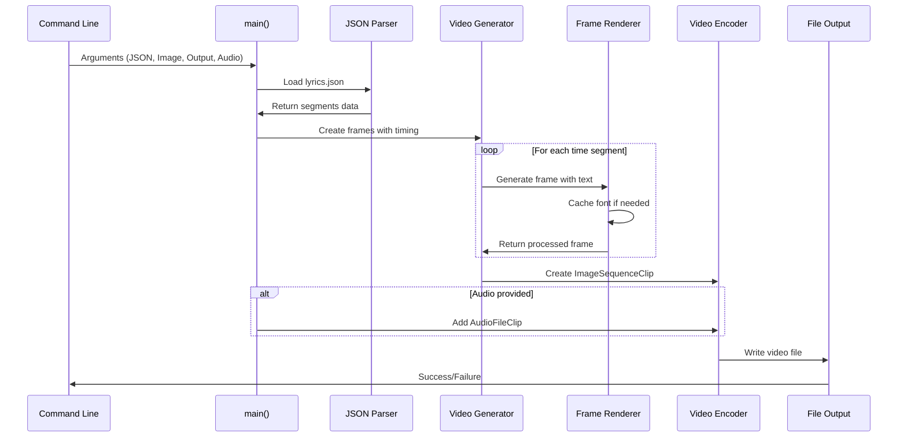
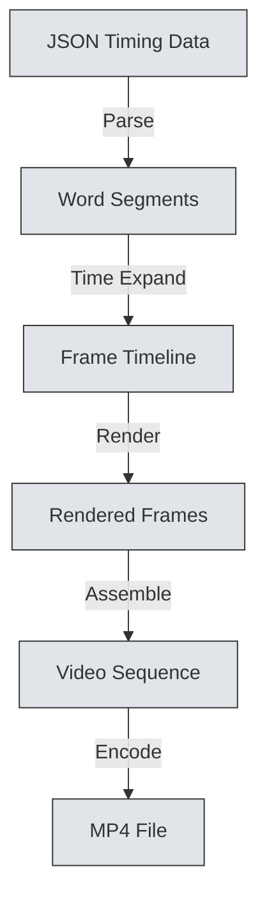
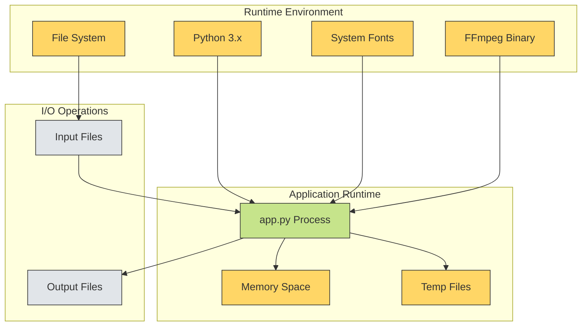

# Architect Project Review

## 1) System Overview

The Karaoke Video Generator is a Python-based batch processing system that transforms structured lyric timing data into synchronized video content. The system operates as a single-threaded command-line application with no persistent state or external service dependencies.

**Core Processing Model**: Frame-by-frame video generation with text overlay rendering, where each frame is constructed individually and then assembled into the final video sequence.

**Data Flow Pattern**: Linear pipeline from JSON parsing → frame generation → video assembly → file output.

## 2) Repository & Component Map

```
Repository Structure:
├── app.py              # Main application (200+ lines)
├── lyrics.json         # Sample Hebrew lyrics data
├── background.jpg      # Sample background image
├── karaoke.wav         # Sample audio file
├── req.txt             # Python dependencies
└── README.md           # Basic usage instructions
```

**Component Analysis**:
- **Monolithic Architecture**: Single file contains all business logic
- **No Modular Separation**: Functions are interdependent without clear interfaces
- **No Configuration Layer**: All parameters are hard-coded or command-line arguments
- **No Persistence Layer**: Stateless processing with file-based I/O only

## 3) Architecture & Dependencies

```mermaid
graph LR
    subgraph "Application Layer"
        A[main()]:::core
        B[create_karaoke_video]:::core
        C[draw_lyrics_on_frame]:::core
        D[get_font]:::core
    end
    
    subgraph "External Libraries"
        E[MoviePy]:::external
        F[PIL/Pillow]:::external
        G[NumPy]:::external
        H[JSON]:::external
    end
    
    subgraph "System Dependencies"
        I[FFmpeg]:::infrastructure
        J[System Fonts]:::infrastructure
    end
    
    subgraph "Data Flow"
        K[JSON Input]:::data
        L[Image Frames]:::data
        M[Video Output]:::data
    end
    
    A --> B
    B --> C
    C --> D
    B --> E
    C --> F
    C --> G
    E --> I
    D --> J
    K --> A
    B --> L
    L --> M
    
    classDef core fill:#c6e48b,stroke:#333
    classDef external fill:#9c7bff,stroke:#333
    classDef infrastructure fill:#ffd666,stroke:#333
    classDef data fill:#e1e5e9,stroke:#333
```

**Dependency Analysis**:
- **Tight Coupling**: Direct dependency on specific library versions
- **System-Level Dependencies**: FFmpeg and fonts not managed by package manager
- **No Abstraction Layer**: Direct API calls to external libraries
- **Version Pinning**: Some dependencies locked to specific versions

## 4) Execution Flows



**Execution Characteristics**:
- **Synchronous Processing**: No asynchronous operations
- **Memory-Intensive**: All frames held in memory simultaneously
- **Blocking I/O**: File operations block execution
- **No Retry Logic**: Single attempt for all operations

## 5) Data Flow & State Model

**Input Data Structure**:
```json
{
  "language": "he",           // Language code
  "duration": 181.66,         // Total duration seconds
  "segments": [               // Array of lyric segments
    {
      "id": 0,                // Segment identifier
      "start": 8.26,          // Start time (seconds)
      "end": 16.48,           // End time (seconds)
      "text": "...",          // Full segment text
      "words": [              // Individual word timing
        {
          "word": "לא",       // Word text
          "start": 8.26,      // Word start time
          "end": 9.38,        // Word end time
          "confidence": 0.33  // Recognition confidence
        }
      ]
    }
  ]
}
```

**Processing State Model**:
- **Stateless**: No persistent state between executions
- **Frame State**: Each frame generated independently
- **Memory State**: All frames accumulated before video creation
- **No Transaction Model**: No rollback on failure

**Data Transformation Pipeline**:


## 6) Configuration & Environment Model

**Configuration Approach**: Hard-coded constants with command-line override

**Key Configuration Points**:
```python
# Video encoding parameters
fps = 24  # Hard-coded frame rate
codec = 'libx264'  # Fixed video codec
audio_codec = None  # Audio codec setting

# Text rendering parameters
fontsize = 60  # Fixed font size
font_path = "/usr/share/fonts/truetype/dejavu/DejaVuSans-Bold.ttf"  # Hard-coded path

# Processing parameters
# No batch size limits
# No memory management
# No timeout settings
```

**Environment Dependencies**:
- **Font Availability**: Requires specific system fonts
- **FFmpeg Installation**: System-level video processing
- **File System Permissions**: Read/write access to input/output directories
- **Memory Availability**: Unbounded memory requirements

## 7) Deployment & Runtime Topology



**Deployment Characteristics**:
- **Single Process**: No multi-process architecture
- **Local Execution**: No network services required
- **File-Based I/O**: All data exchange via file system
- **No Containerization**: No Docker or container support
- **No Service Discovery**: No service mesh requirements

## 8) Architectural Risk Observations (All Severities)

### Critical Risks
- **Memory Exhaustion** [CRITICAL] - No limits on frame accumulation
- **Font Path Dependencies** [CRITICAL] - Hard-coded system font paths
- **FFmpeg Dependency** [CRITICAL] - System-level binary requirement

### High Risks
- **No Error Handling** [HIGH] - Unhandled exceptions terminate processing
- **No Input Validation** [HIGH] - Assumes well-formed JSON input
- **No Resource Cleanup** [HIGH] - Temporary files may accumulate
- **No Logging** [HIGH] - No operational visibility
- **Single-threaded Processing** [HIGH] - No parallelization opportunities

### Medium Risks
- **Hard-coded Parameters** [MEDIUM] - Limited configurability
- **No Progress Indication** [MEDIUM] - Long operations provide no feedback
- **No Batch Processing** [MEDIUM] - One video per execution
- **Version Lock-in** [MEDIUM] - Specific library versions required

### Low Risks
n- **Code Organization** [LOW] - Monolithic structure limits reusability
- **No Testing Framework** [LOW] - No automated validation
- **Documentation Gaps** [LOW] - Limited technical documentation

## 9) Diagram Legend & Severity Key

### Color Coding
- **Green (#c6e48b)**: Core business logic components
- **Purple (#9c7bff)**: External library dependencies
- **Orange (#ffd666)**: Infrastructure and system dependencies
- **Gray (#e1e5e9)**: Data inputs and outputs

### Severity Tags
- **[CRITICAL]**: System-threatening issues requiring immediate attention
- **[HIGH]**: Significant operational risks needing near-term resolution
- **[MEDIUM]**: Material concerns with long-term impact
- **[LOW]**: Minor issues or improvement opportunities

### Architecture Patterns
- **Monolithic**: Single-file architecture with tight coupling
- **Pipeline**: Linear data transformation flow
- **Stateless**: No persistent state management
- **Synchronous**: Blocking operations throughout
