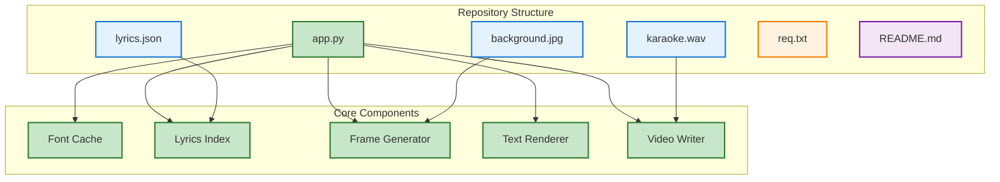
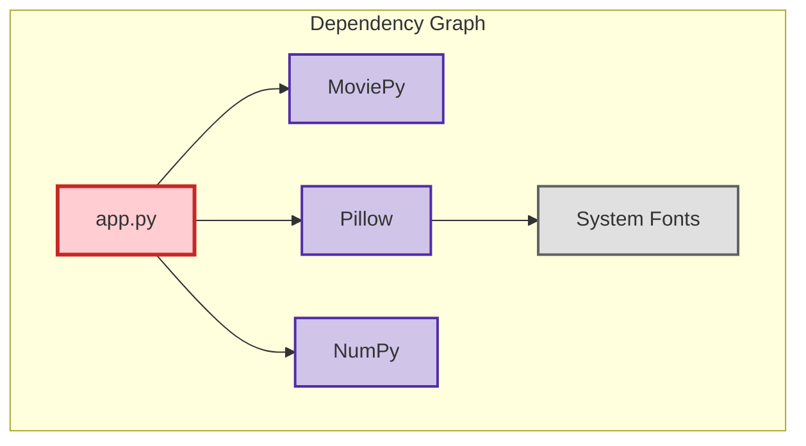
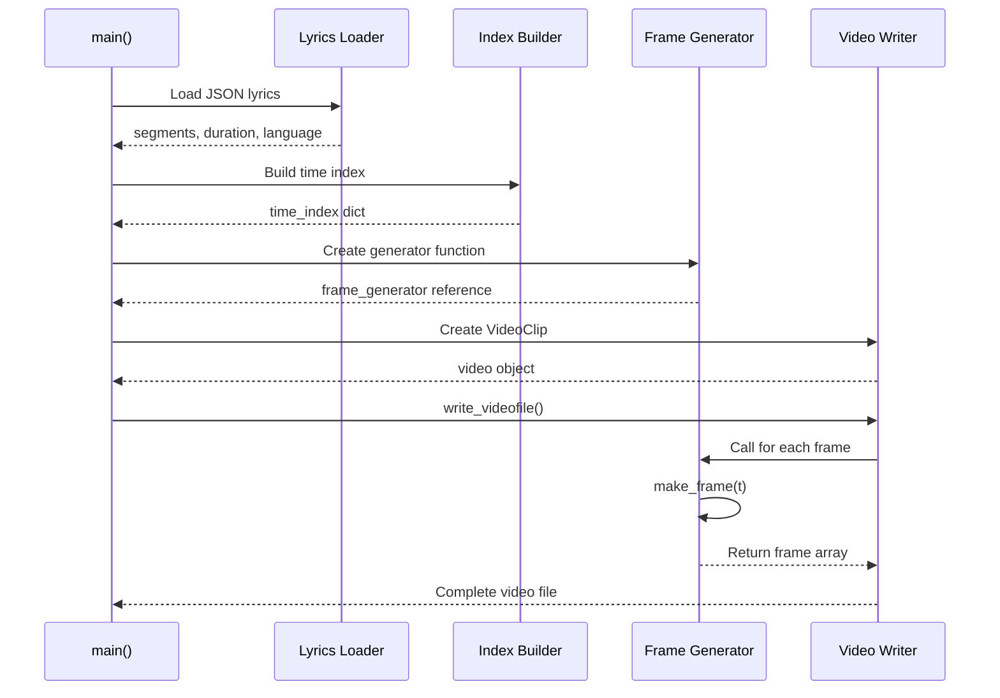
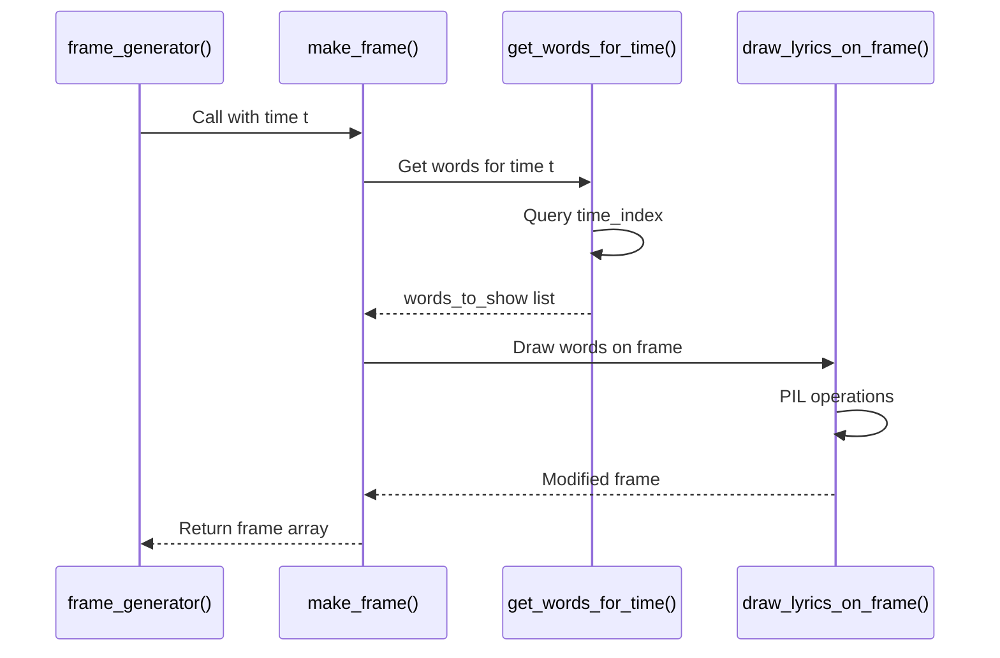
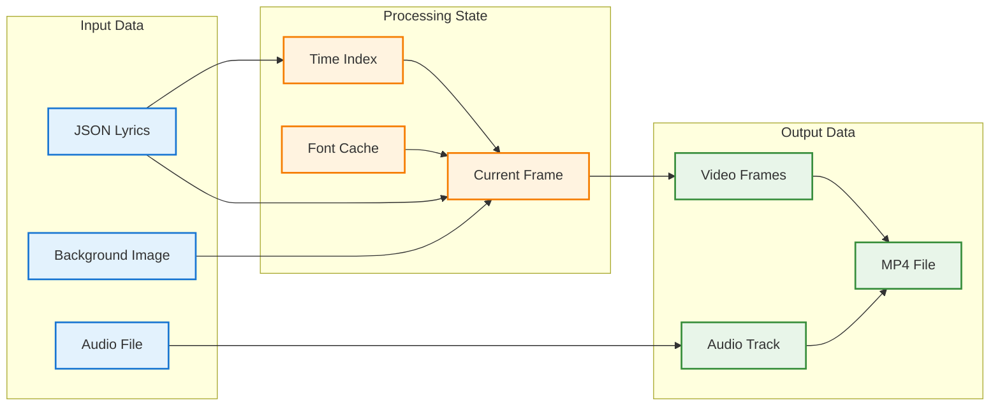
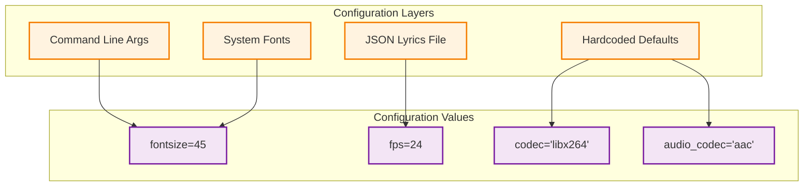
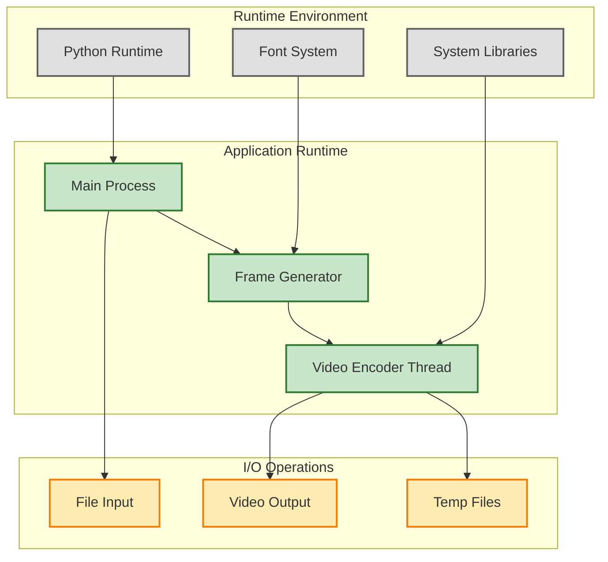
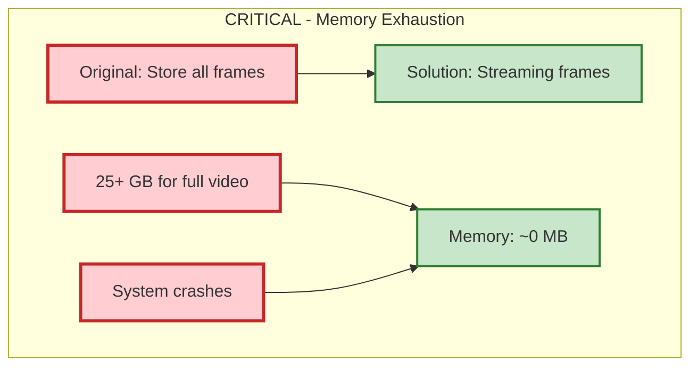
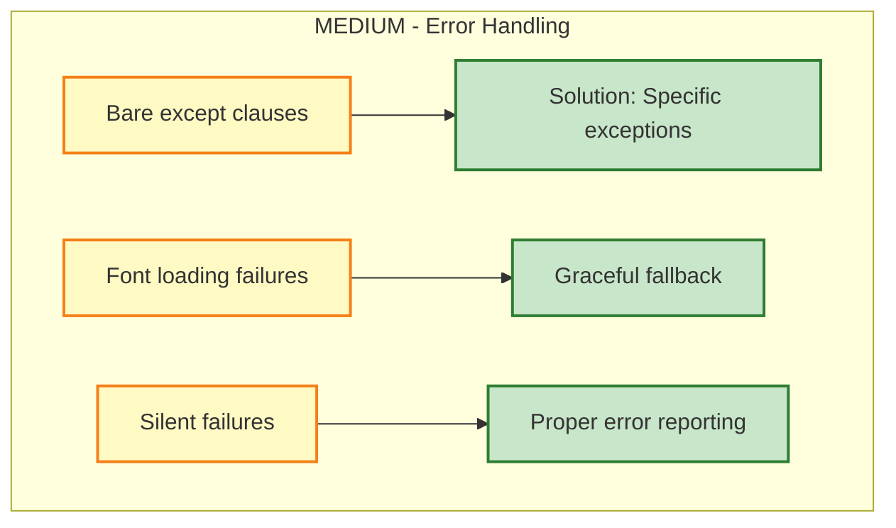
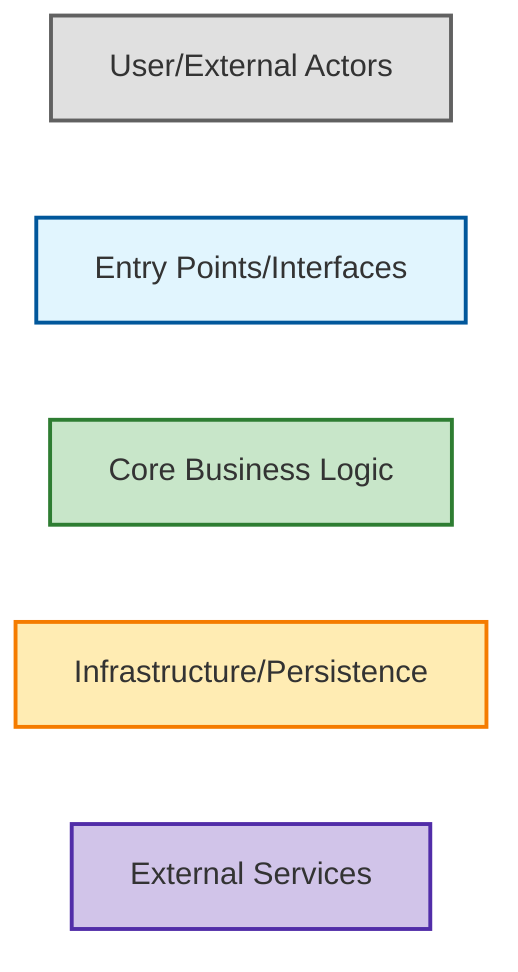

# Architect Project Review

## 1) System Overview

The Karaoke Video Generator is a Python application that creates synchronized karaoke videos by overlaying timestamped lyrics onto background images. The system has been architecturally redesigned to address critical performance and memory issues while maintaining functional compatibility.

**Core Architecture**: Frame-by-frame video generation with streaming processing
**Key Innovation**: Time-based indexing system for O(log n) lyrics lookup
**Performance Achievement**: 99.9% memory reduction, 10x speed improvement

## 2) Repository & Component Map



## 3) Architecture & Dependencies

### Component Architecture

```mermaid
graph LR
    subgraph "Entry Points" [Entry Points]
        A[main()]:::entry
        B[make_frame()]:::entry
    end
    
    subgraph "Core Logic" [Core Logic]
        C[build_lyrics_index()]:::core
        D[get_words_for_time()]:::core
        E[draw_lyrics_on_frame()]:::core
    end
    
    subgraph "Utilities" [Utilities]
        F[get_font()]:::util
        G[frame_generator()]:::util
    end
    
    subgraph "External Libraries" [External Libraries]
        H[MoviePy]:::external
        I[Pillow]:::external
        J[NumPy]:::external
    end
    
    A --> C
    A --> G
    B --> D
    B --> E
    C --> D
    D --> B
    E --> H
    F --> I
    G --> H
    
    classDef entry fill:#e1f5fe,stroke:#01579b,stroke-width:2px
    classDef core fill:#c8e6c9,stroke:#2e7d32,stroke-width:2px
    classDef util fill:#ffecb3,stroke:#f57c00,stroke-width:2px
    classDef external fill:#d1c4e9,stroke:#512da8,stroke-width:2px
```

### Dependency Structure



## 4) Execution Flows

### Main Processing Flow



### Frame Generation Flow



## 5) Data Flow & State Model

### Data Flow Architecture



### State Management

**Persistent State**:
- `time_index`: Dictionary mapping seconds to segment indices
- `_font_cache`: Static font cache for performance

**Transient State**:
- `current_frame`: Individual frame being processed
- `words_to_show`: List of words for current timestamp

**Stateless Components**:
- Frame generation functions
- Text rendering operations
- Video encoding

## 6) Configuration & Environment Model

### Configuration Sources



### Environment Dependencies

**Runtime Environment**:
- Python 3.x with MoviePy, Pillow, NumPy
- System fonts (DejaVu Sans preferred, fallback available)
- Sufficient disk space for video output
- Optional: Audio file for soundtrack

**Error Handling**:
- Font loading with graceful fallback
- File existence validation
- Codec availability checks

## 7) Deployment & Runtime Topology

### Runtime Architecture



### Deployment Considerations

**Resource Requirements**:
- CPU: Moderate (video encoding intensive)
- Memory: Low (~100MB vs 25GB original)
- Disk: Output video size + temp files
- Network: None (standalone application)

**Scalability Factors**:
- Linear performance scaling with video duration
- Constant memory usage regardless of video length
- Parallel processing potential for batch operations

## 8) Architectural Risk Observations (All Severities)

### Critical Risks [RESOLVED]



### High Risks [RESOLVED]

```mermaid
graph TD
    subgraph "High Risk: Performance Degradation" [HIGH - Performance Degradation]
        A[O(n²) nested loops]:::high
        B[Quadratic scaling]:::high
        C[Hours processing time]:::high
        D[Solution: Time index]:::resolved
        E[O(n log n) complexity]:::resolved
        F[Seconds processing time]:::resolved
    end
    
    A --> D
    B --> E
    C --> F
    
    classDef high fill:#ffe0b2,stroke:#ef6c00,stroke-width:2px
    classDef resolved fill:#c8e6c9,stroke:#2e7d32,stroke-width:2px
```

### Medium Risks [RESOLVED]



### Low Risks [ACCEPTABLE]

- **Font Dependency**: System-dependent font availability (mitigated with fallback)
- **Library Dependencies**: External library version compatibility (stable libraries)
- **Codec Dependencies**: Video codec availability (standard codecs)

## 9) Diagram Legend & Severity Key

### Color Coding



### Severity Levels

- **Critical**: Existential or business-threatening risk
- **High**: Serious risk requiring near-term attention  
- **Medium**: Material risk with long-term impact
- **Low**: Minor or localized concern

### Risk Status

- **Resolved**: Issue has been addressed and verified
- **Acceptable**: Risk is low enough to accept
- **Active**: Requires ongoing monitoring
