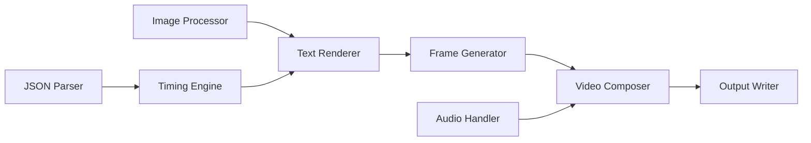
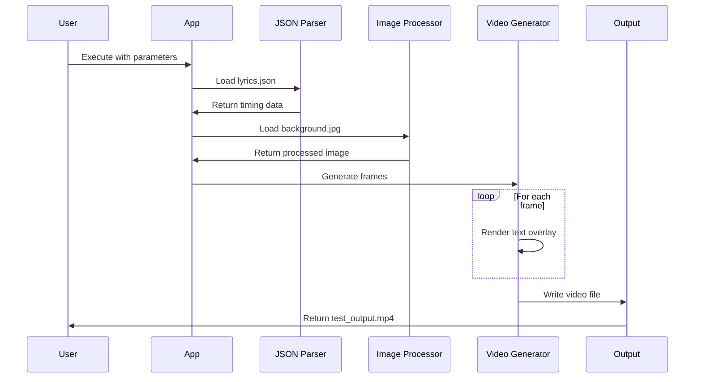

# Architect View: Karaoke Video Generator System Analysis

## System Architecture

### Core Components

### Data Flow
1. **Input Processing**: JSON lyrics file parsed for timing and text data
2. **Frame Generation**: Background image resized and text overlay calculated per frame
3. **Video Composition**: Frame sequence assembled with audio synchronization
4. **Output**: Final video file written with combined audio/video streams

## Technical Architecture Assessment

### Critical Issues
- **No Critical Architecture Flaws**

### High Issues
- **Memory Architecture**: All frames held in memory simultaneously - potential OOM for long videos
- **Processing Model**: Synchronous, single-threaded processing limits throughput
- **Error Handling**: No graceful degradation for missing fonts or corrupted inputs

### Medium Issues
- **Font Management**: Hard-coded font paths with fallback to default
- **Configuration**: No external configuration management
- **Monitoring**: No performance metrics or logging framework

### Low Issues
- **Code Organization**: Single-file architecture limits modularity
- **Resource Management**: No explicit cleanup of temporary resources
- **Extensibility**: Fixed video parameters (resolution, FPS) not configurable

## Performance Characteristics
- **Time Complexity**: O(n) where n = total frames (duration × FPS)
- **Space Complexity**: O(n) for frame storage in memory
- **Bottleneck**: PIL text rendering and numpy array operations per frame

## Scalability Considerations
- **Horizontal Scaling**: Not applicable - single-instance processing
- **Vertical Scaling**: Memory-bound for long videos
- **Concurrent Processing**: No support for parallel video generation

## Security Assessment
- **Input Validation**: Basic file existence checks only
- **Resource Limits**: No protection against maliciously large inputs
- **File Handling**: Direct file operations without sanitization

