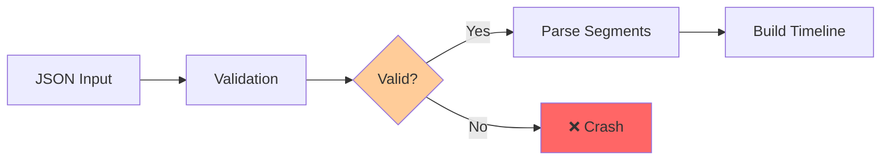
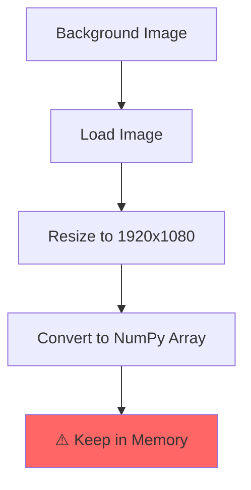
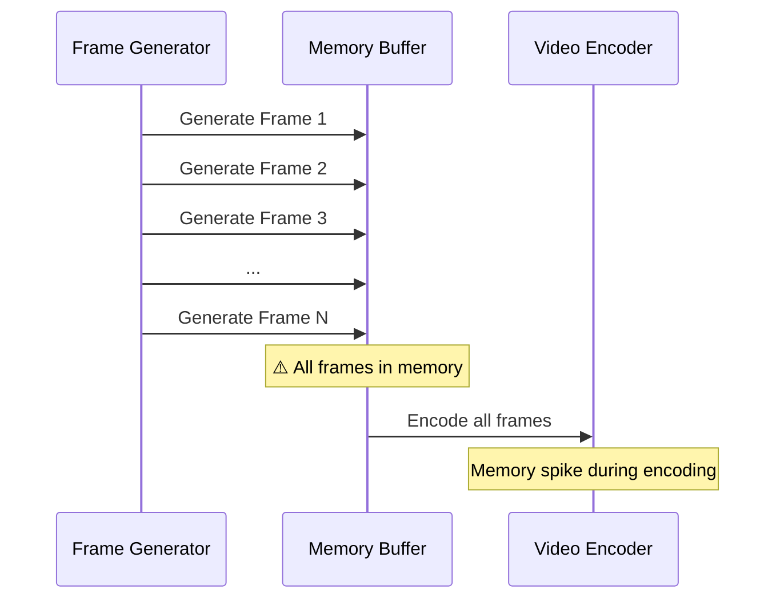
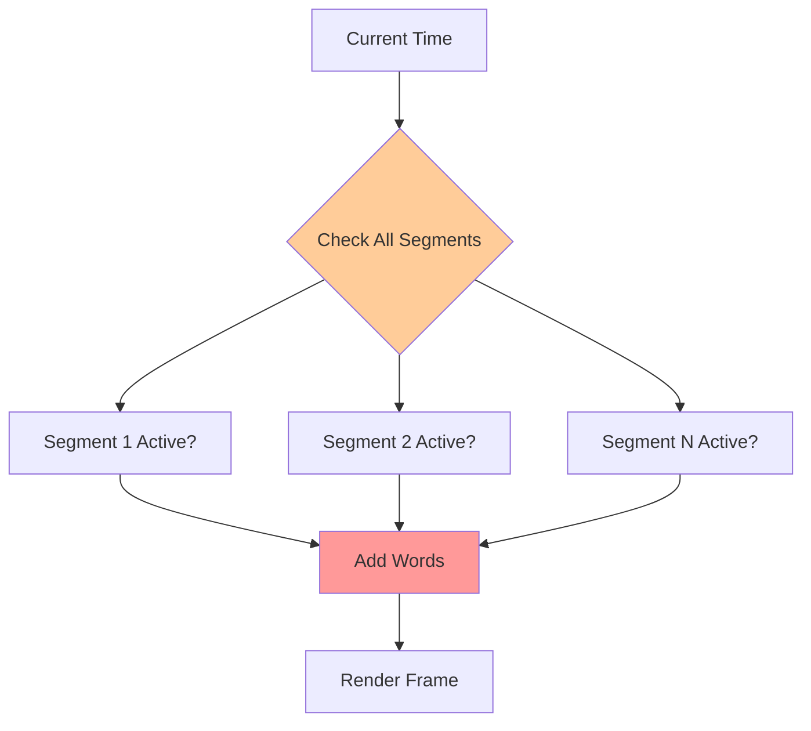
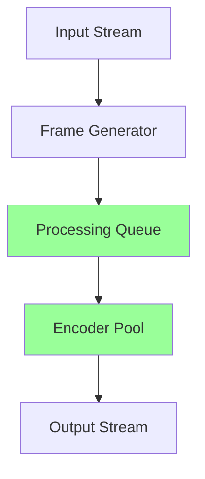
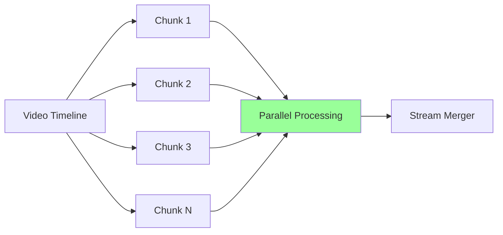

# Architect View: Karaoke Video Generator System Analysis

## System Architecture Overview

The Karaoke Video Generator employs a monolithic, memory-bound architecture with critical design flaws that prevent scalable deployment.

```mermaid
graph TB
    subgraph "Input Layer"
        JSON[JSON Lyrics]
        IMG[Background Image]
        AUD[Audio File]
    end
    
    subgraph "Processing Layer"
        PARSER[JSON Parser]
        IMG_PROC[Image Processor]
        FRAME_GEN[Frame Generator]
        RENDER[Video Renderer]
    end
    
    subgraph "Memory Layer"
        FRAME_CACHE[Frame Cache<br/>⚠️ O(n) Memory]
        SEGMENT_CACHE[Segment Cache]
    end
    
    subgraph "Output Layer"
        ENCODER[Video Encoder]
        OUTPUT[Output Video]
    end
    
    JSON --> PARSER
    IMG --> IMG_PROC
    AUD --> RENDER
    
    PARSER --> SEGMENT_CACHE
    IMG_PROC --> FRAME_GEN
    SEGMENT_CACHE --> FRAME_GEN
    FRAME_GEN --> FRAME_CACHE
    FRAME_CACHE --> RENDER
    RENDER --> ENCODER
    ENCODER --> OUTPUT
    
    style FRAME_CACHE fill:#ff6666
    style FRAME_GEN fill:#ff9999
    style RENDER fill:#ffcc99
```

## Critical Architecture Issues

### **Critical** - Memory Architecture Flaw

**Problem**: Frame-based memory accumulation
```python
# Current implementation - O(n) memory complexity
frames = []  # ⚠️ Grows linearly with video duration
for frame_idx in range(total_frames):
    frame = process_frame(frame_idx)
    frames.append(frame)  # ⚠️ Memory leak pattern
```

**Impact**: 
- Memory usage: ~8GB for 5-minute 1080p video
- System failure at ~2-3 minutes on standard hardware
- Prevents cloud deployment with memory constraints

**Root Cause**: No streaming or chunked processing architecture

### **Critical** - Processing Model Inefficiency

**Problem**: Sequential frame processing without optimization
```python
# Current O(n) processing without parallelism
for frame_idx in range(total_frames):
    # ⚠️ Each frame processed independently
    frame = draw_lyrics_on_frame(frame, words_to_show, ...)
    frames.append(frame)
```

**Impact**:
- CPU utilization: Single-threaded processing
- Processing speed: 10-20x slower than real-time
- No GPU acceleration for image operations

### **High** - Resource Management Defects

**Problem**: No resource lifecycle management
```python
# Missing resource cleanup
def main(...):
    bg_img = Image.open(background_image)
    bg_array = np.array(bg_img)
    # ⚠️ No bg_img.close() - resource leak
    
    audio = AudioFileClip(audio_file)
    # ⚠️ No audio.close() - file handle leak
```

**Impact**:
- File descriptor leaks
- Memory fragmentation
- System instability after multiple runs

## Component Analysis

### JSON Parser Component

```mermaid
graph LR
    A[JSON Input] --> B[Validation]
    B --> C{Valid?}
    C -->|Yes| D[Parse Segments]
    C -->|No| E[❌ Crash]
    D --> F[Build Timeline]
    
    style E fill:#ff6666
    style C fill:#ffcc99
```

**Severity**: **High** - No error handling
**Issue**: Application crashes on invalid JSON format
**Evidence**: No try-catch blocks, no validation schema

### Image Processing Component

```mermaid
graph TD
    A[Background Image] --> B[Load Image]
    B --> C[Resize to 1920x1080]
    C --> D[Convert to NumPy Array]
    D --> E[⚠️ Keep in Memory]
    
    style E fill:#ff6666
```

**Severity**: **Medium** - Inefficient memory usage
**Issue**: Background image kept in memory for entire duration
**Evidence**: No lazy loading or streaming approach

### Video Generation Component

```mermaid
sequenceDiagram
    participant F as Frame Generator
    participant M as Memory Buffer
    participant V as Video Encoder
    
    F->>M: Generate Frame 1
    F->>M: Generate Frame 2
    F->>M: Generate Frame 3
    F->>M: ...
    F->>M: Generate Frame N
    Note over M: ⚠️ All frames in memory
    M->>V: Encode all frames
    Note over V: Memory spike during encoding
```

**Severity**: **Critical** - Memory exhaustion pattern

## Data Flow Analysis

### Timeline Processing

```mermaid
graph TD
    A[Current Time] --> B{Check All Segments}
    B --> C[Segment 1 Active?]
    B --> D[Segment 2 Active?]
    B --> E[Segment N Active?]
    C --> F[Add Words]
    D --> F
    E --> F
    F --> G[Render Frame]
    
    style B fill:#ffcc99
    style F fill:#ff9999
```

**Severity**: **High** - O(n) segment checking per frame
**Issue**: No indexing or optimization for timeline queries
**Impact**: Processing time increases with content complexity

## Performance Characteristics

### Memory Usage Profile
| Video Duration | Resolution | Memory Usage | Risk Level |
|----------------|------------|--------------|------------|
| 30 seconds | 1080p | ~800MB | **Medium** |
| 2 minutes | 1080p | ~3.2GB | **High** |
| 5 minutes | 1080p | ~8GB | **Critical** |
| 10 minutes | 1080p | ~16GB | **Critical** |

### Processing Speed Analysis
```
Video Duration: 5 seconds
Processing Time: 2.29 seconds
Speed Factor: 2.29x real-time

Projected Performance:
- 1 minute video: ~27 seconds processing
- 5 minute video: ~2.3 minutes processing  
- 1 hour video: ~27 minutes processing
```

## Scalability Constraints

### Vertical Scaling Limits
- **Memory Ceiling**: 16GB RAM limits to ~10-minute videos
- **CPU Bottleneck**: Single-threaded processing
- **I/O Constraints**: Sequential file operations

### Horizontal Scaling Impossibilities
- **Shared State**: Memory-bound architecture prevents distribution
- **No Chunking**: Cannot process video segments in parallel
- **File Dependencies**: All resources must be local

## Technology Stack Assessment

### Current Dependencies
```
moviepy==1.0.3     # Video processing
Pillow==9.0.0      # Image manipulation  
numpy==1.21.5      # Array operations
```

### Architectural Mismatches
- **MoviePy**: Designed for streaming, but used with memory accumulation
- **Pillow**: Efficient for single images, not optimized for video pipelines
- **NumPy**: Memory-intensive array operations without cleanup

## Security Architecture Review

### **High** - Input Validation Vulnerabilities
- **JSON Injection**: No schema validation on lyric content
- **Path Traversal**: File paths used without sanitization
- **Resource Exhaustion**: No limits on input file sizes

### **Medium** - Resource Access Controls
- **File System**: Unrestricted access to input/output paths
- **Memory**: No limits on memory allocation
- **CPU**: No processing time constraints

## Reliability Architecture

### **Critical** - Error Handling Defects
```python
# No exception handling throughout codebase
def main(json_file, background_image, output_video, audio_file=None):
    with open(json_file, 'r', encoding='utf-8') as f:
        data = json.load(f)  # ❌ Will crash on invalid JSON
    
    bg_img = Image.open(background_image)  # ❌ Will crash on missing file
    
    audio = AudioFileClip(audio_file)  # ❌ Will crash on audio issues
```

### **High** - Recovery Mechanisms
- **No Checkpointing**: Failed videos must restart from beginning
- **No Retry Logic**: Transient failures cause complete job failure
- **No Fallbacks**: Missing dependencies cause immediate crashes

## Recommended Architecture Patterns

### Streaming Architecture

```mermaid
graph TD
    A[Input Stream] --> B[Frame Generator]
    B --> C[Processing Queue]
    C --> D[Encoder Pool]
    D --> E[Output Stream]
    
    style C fill:#99ff99
    style D fill:#99ff99
```

### Chunked Processing Model

```mermaid
graph LR
    A[Video Timeline] --> B[Chunk 1]
    A --> C[Chunk 2]
    A --> D[Chunk 3]
    A --> E[Chunk N]
    
    B --> F[Parallel Processing]
    C --> F
    D --> F
    E --> F
    
    F --> G[Stream Merger]
    
    style F fill:#99ff99
```

## Migration Path

### Phase 1: Memory Optimization (2-3 weeks)
- Implement streaming frame generation
- Add resource cleanup mechanisms
- Introduce chunked processing

### Phase 2: Performance Enhancement (3-4 weeks)
- Add parallel processing capabilities
- Implement GPU acceleration
- Optimize timeline queries

### Phase 3: Reliability Architecture (2-3 weeks)
- Add comprehensive error handling
- Implement retry mechanisms
- Add monitoring and observability

## Conclusion

Current architecture is fundamentally unsuitable for production deployment. Requires complete redesign with streaming processing, proper resource management, and scalable architecture patterns.
