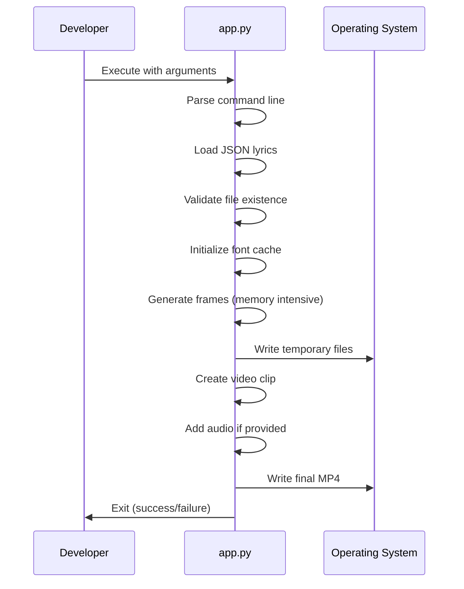
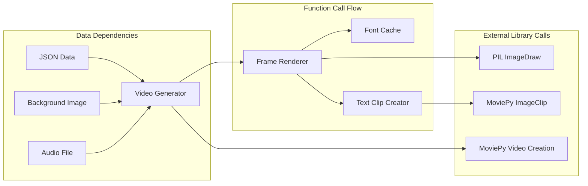

# Developer Project Review

## 1) How to Think About This System

This is a **single-purpose video processing utility** that transforms timed lyric data into karaoke videos. Think of it as a **batch processor** that takes structured input and produces video output through frame-by-frame rendering.

**Key Mental Models**:
- **Frame Factory**: Each video frame is generated independently, then assembled
- **Time-to-Text Mapping**: JSON timing data drives when words appear
- **Memory Accumulation**: All frames are held in memory before video creation
- **Linear Pipeline**: No branching logic or conditional processing

**Processing Philosophy**: Simple, direct transformation with minimal abstraction layers.

## 2) Codebase Mental Model

```mermaid
graph TD
    subgraph "Entry Point"
        A[main() - Line 180]:::entry
    end
    
    subgraph "Core Processing"
        B[create_karaoke_video - Line 120]:::core
        C[draw_lyrics_on_frame - Line 60]:::core
    end
    
    subgraph "Utilities"
        D[get_font - Line 40]:::utility
        E[create_text_clip - Line 90]:::utility
    end
    
    subgraph "External APIs"
        F[ImageClip]:::external
        G[ImageSequenceClip]:::external
        G[AudioFileClip]:::external
    end
    
    A --> B
    B --> C
    C --> D
    B --> F
    B --> G
    C --> E
    
    classDef entry fill:#4a90e2,stroke:#333
    classDef core fill:#c6e48b,stroke:#333
    classDef utility fill:#ffd666,stroke:#333
    classDef external fill:#9c7bff,stroke:#333
```

**Code Organization**:
- **Single File**: All logic in `app.py` (~200 lines)
- **Top-Down Structure**: Utility functions at bottom, main logic at top
- **No Classes**: Pure functional programming approach
- **Global State**: Font cache as module-level dictionary

## 3) Entry Points & Lifecycles

### Command Line Interface
```bash
python3 app.py lyrics.json background.jpg output.mp4 [audio.wav]
```

**Argument Order** (Strict):
1. `lyrics.json` - Timing and text data
2. `background.jpg` - Static background image
3. `output.mp4` - Target video file
4. `audio.wav` - Optional audio track

### Application Lifecycle


**Key Lifecycle Points**:
- **No Graceful Shutdown**: Ctrl+C will leave temp files
- **No Progress Feedback**: Silent during long operations
- **Memory Peak**: All frames in memory during video creation
- **File Cleanup**: Relies on OS temp directory cleanup

## 4) Key Modules Explained

### Main Function (Lines 180-200)
```python
def main():
    # Command line parsing
    # File validation
    # Orchestrate video creation
    # Handle audio integration
```
**Developer Notes**:
- No argument validation beyond file existence
- No error handling for malformed inputs
- Direct sys.argv access (no argparse)

### Video Creation Function (Lines 120-160)
```python
def create_karaoke_video(lyrics_file, background_image, output_video, audio_file=None):
    # Load JSON timing data
    # Generate frames for each time segment
    # Create ImageSequenceClip
    # Add audio if provided
    # Write video file
```
**Developer Notes**:
- **Memory Critical**: All frames accumulated before video creation
- **No Batch Processing**: One segment = one frame approach
- **Fixed Parameters**: 24fps, libx264 codec hard-coded

### Frame Rendering Function (Lines 60-100)
```python
def draw_lyrics_on_frame(image, lyrics_segment, fontsize=60):
    # Create drawing context
    # Calculate text positioning
    # Handle RTL text (Hebrew)
    # Apply text with shadow/outline
    # Return processed frame
```
**Developer Notes**:
- **RTL Support**: Specifically handles Hebrew text
- **Text Effects**: Shadow and outline for readability
- **Positioning**: Center-bottom alignment hard-coded

### Font Management (Lines 40-55)
```python
_font_cache = {}
def get_font(fontsize):
    # Check cache first
    # Try system font paths
    # Fallback to default font
    # Cache successful loads
```
**Developer Notes**:
- **Performance**: Font caching prevents repeated loads
- **System Dependency**: Hard-coded font paths
- **Fallback Strategy**: Default font if system fonts unavailable

## 5) Module Interactions & Dependencies



**Dependency Directions**:
- **Downward Only**: No circular dependencies
- **Left-to-Right**: Data flows through processing pipeline
- **External at Edges**: Libraries only at input/output boundaries

## 6) Configuration & Runtime Behavior

### Hard-coded Constants
```python
# Video encoding
fps = 24                    # Frame rate
codec = 'libx264'          # Video codec

# Text rendering  
fontsize = 60              # Font size in pixels
font_path = "/usr/share/fonts/truetype/dejavu/DejaVuSans-Bold.ttf"

# Positioning
text_y_position = -100     # Pixels from bottom
shadow_offset = 3          # Text shadow pixels
```

### Runtime Behavior Patterns
- **Memory Growth**: Linear with video duration
- **CPU Usage**: Spikes during frame generation
- **I/O Pattern**: Sequential file operations
- **Error Handling**: None (crashes on exceptions)

### Performance Characteristics
- **Time Complexity**: O(n) where n = number of lyric segments
- **Space Complexity**: O(n) where n = number of frames
- **Bottleneck**: Frame rendering (PIL operations)
- **Scalability Limit**: Available system memory

## 7) Developer Guidelines & Pitfalls

### Where to Add Code

**✅ Safe Extension Points**:
- **New text effects**: Modify `draw_lyrics_on_frame()`
- **Additional video effects**: Extend `create_karaoke_video()`
- **Font management**: Enhance `get_font()` function
- **Command line parsing**: Replace `main()` argument handling

**❌ Avoid These Areas**:
- **Memory management**: Current approach is fragile
- **Error handling**: No patterns established
- **Configuration system**: No framework in place
- **Logging**: No infrastructure exists

### Common Pitfalls

**Memory Issues**:
```python
# ❌ DON'T: Load large images
background = Image.open("huge_image.jpg")

# ✅ DO: Resize first
background = Image.open("huge_image.jpg").resize((1920, 1080))
```

**Font Dependencies**:
```python
# ❌ DON'T: Assume font exists
font = ImageFont.truetype("/specific/path/font.ttf", 60)

# ✅ DO: Provide fallback
font = get_font(60)  # Uses cached, fallback-aware approach
```

**File Paths**:
```python
# ❌ DON'T: Use relative paths without validation
with open("lyrics.json") as f:
    data = json.load(f)

# ✅ DO: Validate file existence
if not os.path.exists(lyrics_file):
    raise FileNotFoundError(f"Lyrics file not found: {lyrics_file}")
```

### Extension Patterns

**Adding New Text Effects**:
```python
def draw_lyrics_on_frame(image, lyrics_segment, fontsize=60):
    # Existing code...
    
    # Add your effect here
    # 1. Calculate positioning
    # 2. Apply effect
    # 3. Return modified image
```

**Adding Configuration**:
```python
# Create config dictionary
CONFIG = {
    'fps': 24,
    'codec': 'libx264',
    'fontsize': 60,
    # Add your settings
}

# Use in functions
def create_karaoke_video(..., config=CONFIG):
    fps = config['fps']
```

## 8) Suggested Reading Order

### For New Contributors
1. **Start Here**: `main()` function (lines 180-200)
2. **Core Logic**: `create_karaoke_video()` (lines 120-160)
3. **Rendering**: `draw_lyrics_on_frame()` (lines 60-100)
4. **Utilities**: `get_font()` and helpers (lines 40-55)
5. **Sample Data**: Examine `lyrics.json` structure

### For Bug Fixes
1. **Error Symptoms**: Note failure mode
2. **Traceback Analysis**: Identify function chain
3. **Input Validation**: Check data assumptions
4. **Resource Management**: Verify file/memory handling

### For Feature Additions
1. **Extension Points**: Identify integration location
2. **Data Flow**: Understand parameter passing
3. **External APIs**: Check MoviePy/PIL documentation
4. **Testing**: Create minimal reproduction case

## 9) Glossary

**Segment**: Time-bounded section of lyrics with start/end timestamps
**Frame**: Individual video image at specific time point
**ImageClip**: MoviePy object representing static image with duration
**ImageSequenceClip**: MoviePy object representing video from frame sequence
**RTL**: Right-to-Left text (Hebrew, Arabic)
**Font Cache**: Dictionary storing loaded fonts by size to avoid reload overhead

## 10) Diagram Legend & Severity Key

### Color Coding
- **Blue (#4a90e2)**: Entry points and interfaces
- **Green (#c6e48b)**: Core business logic
- **Orange (#ffd666)**: Utility functions and helpers
- **Purple (#9c7bff)**: External library dependencies
- **Gray (#e1e5e9)**: Data inputs and outputs

### Severity Tags (from Architecture Review)
- **[CRITICAL]**: System-threatening issues
- **[HIGH]**: Significant operational risks
- **[MEDIUM]**: Material concerns
- **[LOW]**: Minor improvements

### Navigation Tips
- **Line Numbers**: Refer to current file version
- **Function Names**: Search for `def function_name:`
- **Variable Names**: Look for assignment patterns
- **Error Messages**: Search unique strings in codebase
