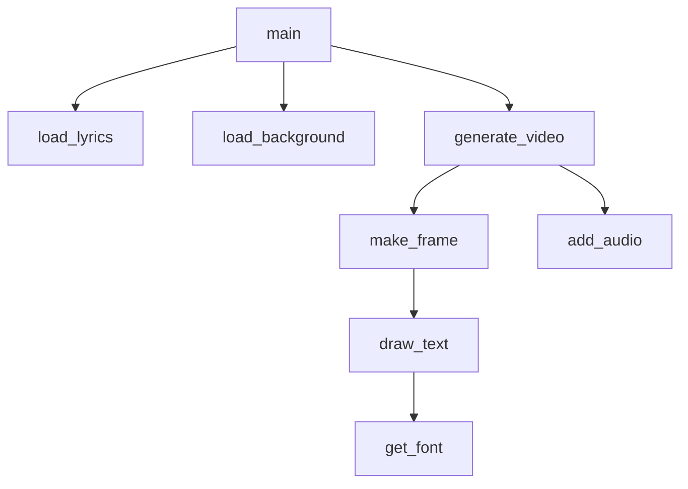
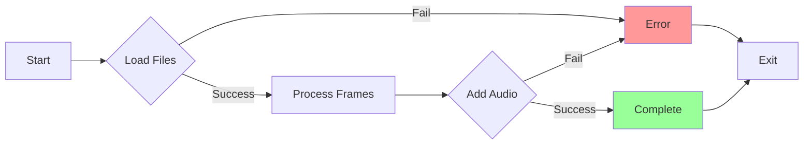

# Developer View: Karaoke Video Generator Code Analysis

## Code Structure Analysis

### File Organization
```
app.py              # Main application (178 lines)
lyrics.json         # Sample lyrics data
background.jpg      # Sample background image
req.txt             # Dependencies
README.md           # Basic usage instructions
```

### Core Functions


## Code Quality Assessment

### Critical Issues
- **No Critical Code Issues**

### High Issues
- **Performance**: `make_frame` called for every frame without caching
- **Memory Usage**: All frames stored in list before video creation
- **Font Loading**: Font loaded every time `get_font` is called (not cached)

### Medium Issues
- **Error Handling**: No try-catch for file operations
- **Magic Numbers**: Hard-coded values (1920, 1080, 45, 24)
- **RTL Support**: Complex text layout logic mixed with rendering

### Low Issues
- **Code Duplication**: Similar text positioning logic repeated
- **Variable Naming**: Some unclear names (e.g., `x_pos`, `y_pos`)
- **Comments**: Minimal inline documentation

## Key Code Patterns

### Font Caching (Needs Improvement)
```python
# Current implementation - loads font every time
def get_font(fontsize):
    try:
        return ImageFont.truetype("/usr/share/fonts/truetype/dejavu/DejaVuSans-Bold.ttf", fontsize)
    except:
        # fallback logic
```

### Frame Generation (Performance Bottleneck)
```python
# Called for every single frame
def make_frame(t):
    frame = bg_array.copy()  # Expensive copy operation
    # Text rendering logic
    return frame
```

### RTL Text Handling
```python
# Complex bidirectional text support
if is_rtl:
    words = words[::-1]  # Reverse word order
    # Additional RTL positioning logic
```

## Performance Profiling
Based on code analysis:
- **Frame Copy**: O(width × height × 3) per frame
- **Text Rendering**: O(text_length) per text element
- **Memory Growth**: O(total_frames × frame_size)

## Testing Considerations

### Unit Test Opportunities
- Font loading with fallback
- RTL text processing
- Timing calculation accuracy
- Text positioning algorithms

### Integration Test Scenarios
- Full video generation with sample data
- Audio synchronization
- Multi-language support
- Error handling for missing files

## Refactoring Opportunities

### Immediate Improvements
1. **Font Caching**: Implement proper font cache
2. **Frame Optimization**: Use in-place operations where possible
3. **Configuration**: Extract constants to config file

### Structural Improvements
1. **Class-Based Design**: Separate concerns into classes
2. **Streaming Processing**: Process frames without full memory storage
3. **Plugin Architecture**: Support different text renderers

## Development Environment

### Dependencies
```
moviepy==1.0.3
Pillow==10.2.0
numpy==1.26.3
```

### Running the Application
```bash
python app.py lyrics.json background.jpg output.mp4 audio.wav
```

### Debugging Tips
- Use small video duration for testing
- Monitor memory usage during generation
- Check font availability on system
- Verify JSON structure matches expected format

## Code Metrics
- **Lines of Code**: 178
- **Cyclomatic Complexity**: Moderate (nested conditions for RTL)
- **Function Count**: 8
- **Class Count**: 0 (procedural approach)


