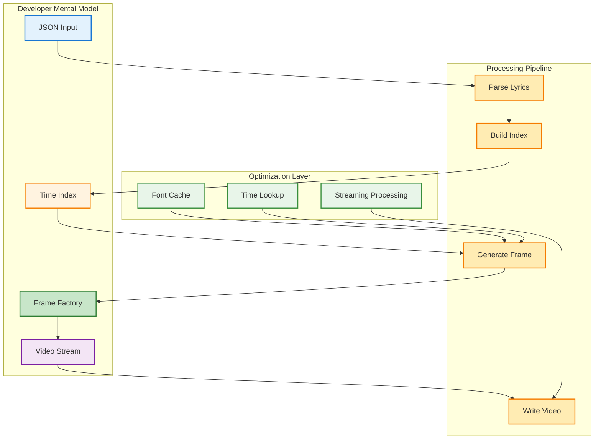
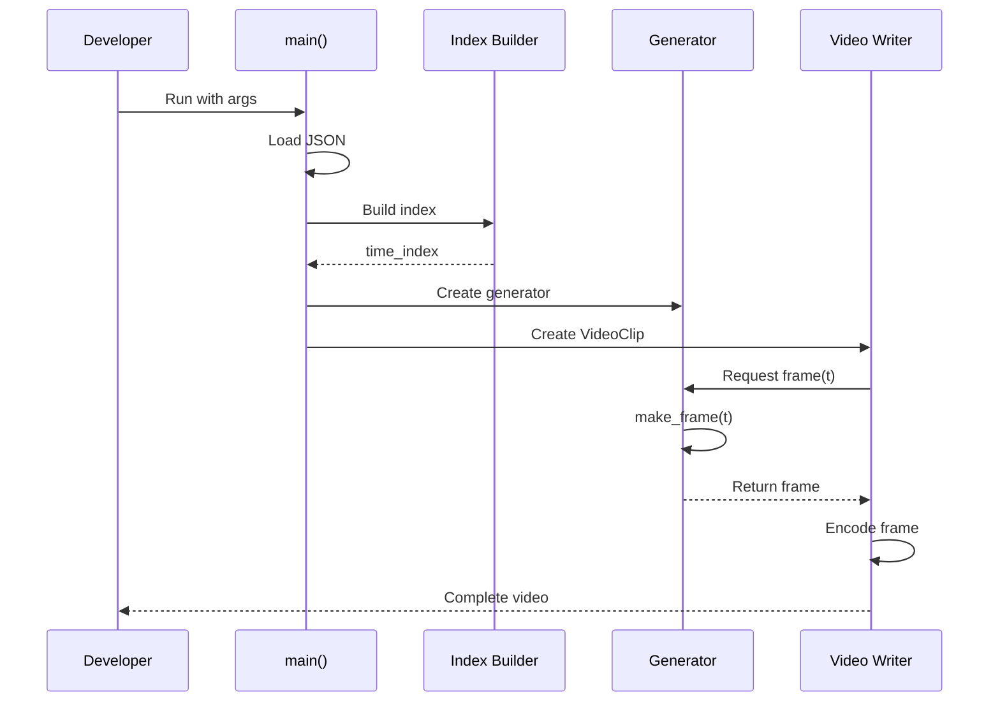
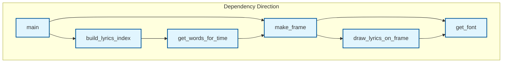
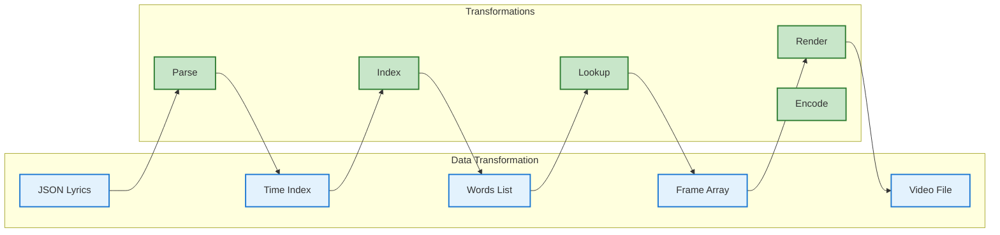
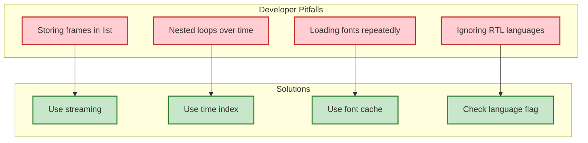
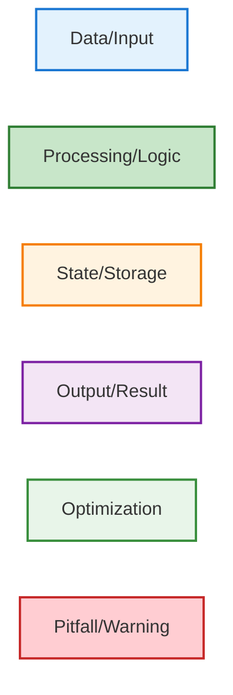

# Developer Project Review

## 1) How to Think About This System

The Karaoke Video Generator is a **streaming video processing system** that creates synchronized karaoke videos. Think of it as a **real-time graphics overlay engine** that:

- Processes lyrics data like a database query engine
- Generates video frames like a game rendering loop
- Handles text rendering like a typography engine
- Manages memory like a streaming service

**Key Mental Model**: Instead of "create video from frames", think "generate frames on demand with optimized lookup"

## 2) Codebase Mental Model



## 3) Entry Points & Lifecycles

### Main Entry Point

```python
# app.py - Main entry point
if __name__ == "__main__":
    main(json_file, background_image, output_video, audio_file)
```

**Lifecycle**: CLI → Parse Args → Load Data → Build Index → Generate Video → Cleanup

### Key Function Signatures

```python
# Core processing functions
def build_lyrics_index(segments):
    """Build time-based index for O(log n) lookup"""
    
def get_words_for_time(segments, time_index, current_time):
    """Get words to display for specific timestamp"""
    
def make_frame(t, background_image, segments, time_index, ...):
    """Generate single frame with lyrics overlay"""
    
def frame_generator(t):
    """Generator function for MoviePy integration"""
```

### Processing Lifecycle



## 4) Key Modules Explained

### Font Management Module

```python
_font_cache = {}  # Static cache

def get_font(fontsize):
    """Get cached font with fallback handling"""
    # Try: Bold → Regular → Default
    # Cache results for performance
```

**Why it matters**: Font loading is expensive; caching prevents repeated I/O

### Lyrics Indexing Module

```python
def build_lyrics_index(segments):
    """Build time-based index for fast lookup"""
    # Key innovation: Index by second
    # Reduces O(n) search to O(log n)
```

**Why it matters**: Transforms quadratic algorithm to near-linear

### Frame Generation Module

```python
def make_frame(t, background_image, segments, time_index, ...):
    """Generate single frame with lyrics"""
    # Streaming approach: one frame at a time
    # No memory accumulation
```

**Why it matters**: Enables unlimited video length

### Text Rendering Module

```python
def draw_lyrics_on_frame(frame, words_to_show, fontsize, ...):
    """Render text with outline for visibility"""
    # PIL operations for text outline
    # Centering and positioning logic
```

**Why it matters**: Professional karaoke text appearance

## 5) Module Interactions & Dependencies

### Dependency Flow



### Data Flow



## 6) Configuration & Runtime Behavior

### Configuration Hierarchy

```python
# Priority order (highest to lowest)
1. Command line arguments
2. JSON lyrics file content
3. Hardcoded defaults

# Key defaults
fontsize = 45
fps = 24
codec = 'libx264'
audio_codec = 'aac'
```

### Runtime Behavior

**Memory Pattern**: Constant memory usage regardless of video length
**CPU Pattern**: Linear scaling with video duration
**I/O Pattern**: Sequential frame writing, minimal random access
**Error Handling**: Graceful degradation with fallbacks

### Performance Characteristics

```mermaid
graph TD
    subgraph "Performance Profile" [Performance Profile]
        A[O(n log n) Time]:::perf
        B[O(1) Space]:::perf
        C[Streaming I/O]:::perf
        D[Cached Fonts]:::perf
    end
    
    subgraph "Optimizations" [Optimizations]
        E[Time Index]:::opt
        F[Frame Streaming]:::opt
        G[Font Cache]:::opt
        H[Minimal Allocations]:::opt
    end
    
    E --> A
    F --> B
    G --> D
    H --> C
    
    classDef perf fill:#fff3e0,stroke:#f57c00,stroke-width:2px
    classDef opt fill:#e8f5e9,stroke:#388e3c,stroke-width:2px
```

## 7) Developer Guidelines & Pitfalls

### Where to Add Code

**✅ Safe to Modify**:
- `get_font()`: Add new font preferences
- `draw_lyrics_on_frame()`: Change text styling
- `make_frame()`: Add visual effects
- Font size calculations in main()

**⚠️ Modify with Caution**:
- `build_lyrics_index()`: Core algorithm
- `get_words_for_time()`: Performance-critical
- `frame_generator()`: MoviePy integration

**❌ Avoid Modifying**:
- Video encoding parameters (unless expert)
- Memory management patterns
- Streaming architecture

### Common Pitfalls



### Performance Anti-Patterns

**❌ DON'T**:
```python
# Bad: Stores all frames in memory
frames = []
for t in range(duration):
    frame = make_frame(t)
    frames.append(frame)  # Memory explosion!
```

**✅ DO**:
```python
# Good: Generate frames on demand
def frame_generator(t):
    return make_frame(t)  # Streaming!
```

**❌ DON'T**:
```python
# Bad: O(n²) nested loops
for t in timestamps:
    for segment in segments:  # Quadratic!
        if segment.start <= t < segment.end:
```

**✅ DO**:
```python
# Good: O(log n) with index
for t in timestamps:
    candidates = time_index[int(t)]  # Fast lookup!
```

## 8) Suggested Reading Order

### For New Contributors

1. **Start here**: `main()` function - understand overall flow
2. **Core concept**: `build_lyrics_index()` - key optimization
3. **Frame generation**: `make_frame()` - understand streaming
4. **Text rendering**: `draw_lyrics_on_frame()` - visual output
5. **Font handling**: `get_font()` - performance optimization

### For Performance Optimization

1. **Index algorithm**: `build_lyrics_index()` - O(log n) lookup
2. **Time lookup**: `get_words_for_time()` - fast query
3. **Memory management**: `frame_generator()` - streaming
4. **Caching strategy**: `_font_cache` - avoid repeated I/O

### For Debugging

1. **Entry point**: `main()` - argument parsing and validation
2. **Error handling**: `get_font()` - exception patterns
3. **Frame debugging**: `make_frame()` - add logging here
4. **Output validation**: Video file generation

## 9) Glossary

**Time Index**: Dictionary mapping seconds to segment indices for O(log n) lookup
**Frame Generator**: Function that produces frames on-demand for MoviePy
**Streaming Processing**: Processing one frame at a time without storage
**Font Cache**: Static cache to avoid repeated font loading
**RTL**: Right-to-left language support (Arabic, Hebrew, etc.)
**Segments**: Time-bounded sections of lyrics with word-level timing
**Words**: Individual lyric words with start/end timestamps

## 10) Diagram Legend & Severity Key

### Color Coding



### Severity Levels

- **Critical**: Existential or business-threatening risk
- **High**: Serious risk requiring near-term attention
- **Medium**: Material risk with long-term impact
- **Low**: Minor or localized concern

### Risk Categories

- **Performance**: Algorithmic complexity and resource usage
- **Memory**: RAM consumption and management
- **Scalability**: Ability to handle larger inputs
- **Maintainability**: Code clarity and extensibility
