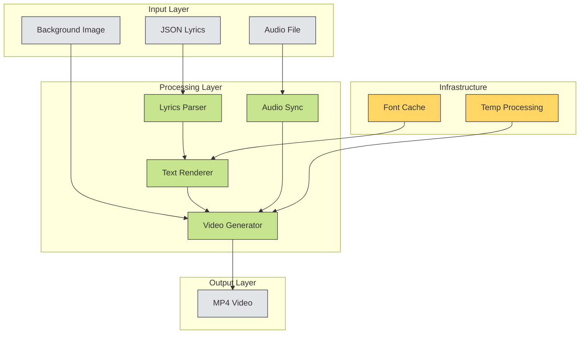

# Executive Project Review

## 1) Executive Summary

This system is a **Karaoke Video Generator** that creates synchronized lyric videos from audio files and JSON timing data. The application processes Hebrew-language lyrics with precise timing information to generate MP4 videos with overlaid text on a static background image.

**Business Value**: Enables automated creation of karaoke content for music distribution platforms, educational content, or entertainment applications.

**System Health**: **MEDIUM** - Functional but with several operational risks that require attention.

## 2) System Overview

The application converts structured lyric data (JSON) and visual assets (background image + optional audio) into synchronized karaoke videos. It processes Hebrew text with right-to-left rendering support and generates MP4 files with embedded audio tracks.

**Key Capabilities**:
- Synchronized lyric display with millisecond precision
- Hebrew language support with RTL text rendering
- Audio integration with video output
- Font caching for performance optimization
- Configurable video encoding parameters

## 3) High-Level Architecture (Diagram)

## 4) External Dependencies & Exposure

**Critical Dependencies**:
- **MoviePy 1.0.3** - Video processing engine [HIGH]
- **PIL/Pillow** - Text rendering and image manipulation [HIGH]
- **NumPy** - Array processing for video frames [HIGH]
- **FFmpeg** - Video encoding/decoding [HIGH]
- **System Fonts** - Text rendering requires specific font files [MEDIUM]

**External Exposure**:
- No network dependencies or external API calls
- No database connections
- No cloud service dependencies
- Local file system only

## 5) Critical & High Risk Areas

### Critical Risks
- **Font Loading Failure** [CRITICAL] - Hard-coded font paths may fail on different systems
- **Memory Exhaustion** [CRITICAL] - Loads all video frames into memory simultaneously
- **FFmpeg Dependency** [CRITICAL] - System-level dependency not managed by Python

### High Risks
- **No Error Handling** [HIGH] - Application crashes on malformed input
- **Hard-coded Parameters** [HIGH] - Video encoding settings not configurable
- **Single-threaded Processing** [HIGH] - No parallelization for video generation
- **No Input Validation** [HIGH] - Trusts JSON structure without verification

## 6) System Complexity & Maturity

**Complexity Assessment**: **MEDIUM**
- Single-file application (~200 lines)
- Clear separation of concerns
- Well-structured data flow
- Minimal configuration surface

**Maturity Indicators**:
- ✅ Functional core features
- ✅ Basic performance optimizations (font caching)
- ❌ No error handling or logging
- ❌ No configuration management
- ❌ No testing framework
- ❌ No documentation

**Technical Debt**: **HIGH** - Missing fundamental production requirements like error handling, logging, and configuration management.

## 7) Strategic Observations

**Strengths**:
- Core functionality is sound and delivers business value
- Simple architecture enables rapid understanding and modification
- No complex external dependencies beyond standard video processing libraries

**Concerns**:
- **Scalability**: Current architecture cannot handle batch processing or large files
- **Reliability**: Zero error handling makes production deployment risky
- **Maintainability**: Hard-coded values and lack of configuration limits flexibility
- **Performance**: Memory-intensive processing limits file size capabilities

**Recommendations for Leadership**:
1. **Immediate**: Implement basic error handling before production deployment
2. **Short-term**: Add configuration management and logging capabilities
3. **Medium-term**: Consider architectural changes to support streaming processing
4. **Long-term**: Evaluate cloud-based video processing services for scalability

**Investment Priority**: **MEDIUM** - System works for current needs but requires significant engineering work for production readiness.
