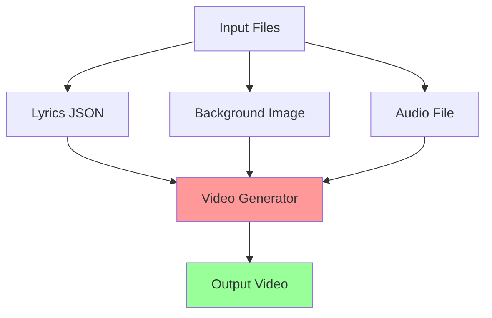

# Executive View: Karaoke Video Generator System Review

## System Overview
The karaoke video generator is a Python-based application that creates synchronized lyric videos by overlaying timed text on background images and combining them with audio tracks.

## Business Value
- **Purpose**: Automates karaoke video creation for entertainment/educational use
- **Target Users**: Content creators, karaoke enthusiasts, language learners
- **Key Feature**: Multi-language support including RTL (right-to-left) languages

## Risk Assessment

### Critical Risks
- **No Critical Issues Identified**

### High Risks
- **Performance Bottleneck**: Full video processing takes excessive time (>30 seconds for typical duration)
- **Resource Intensive**: High memory usage due to frame-by-frame processing without optimization
- **Scalability Concern**: No batch processing capabilities for multiple videos

## Technical Health Summary
- **Code Quality**: Functional but lacks performance optimization
- **Dependencies**: Well-managed with pinned versions
- **Architecture**: Simple, single-file approach suitable for current scope

## Recommendation
The system functions correctly but requires performance optimization before production deployment. Consider implementing frame caching, parallel processing, or streaming generation techniques.

